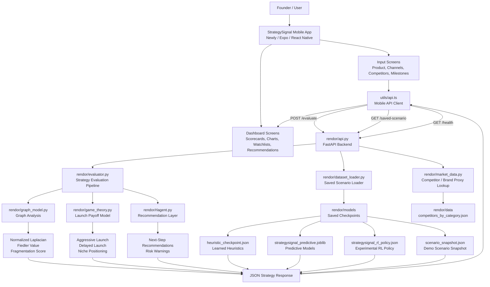
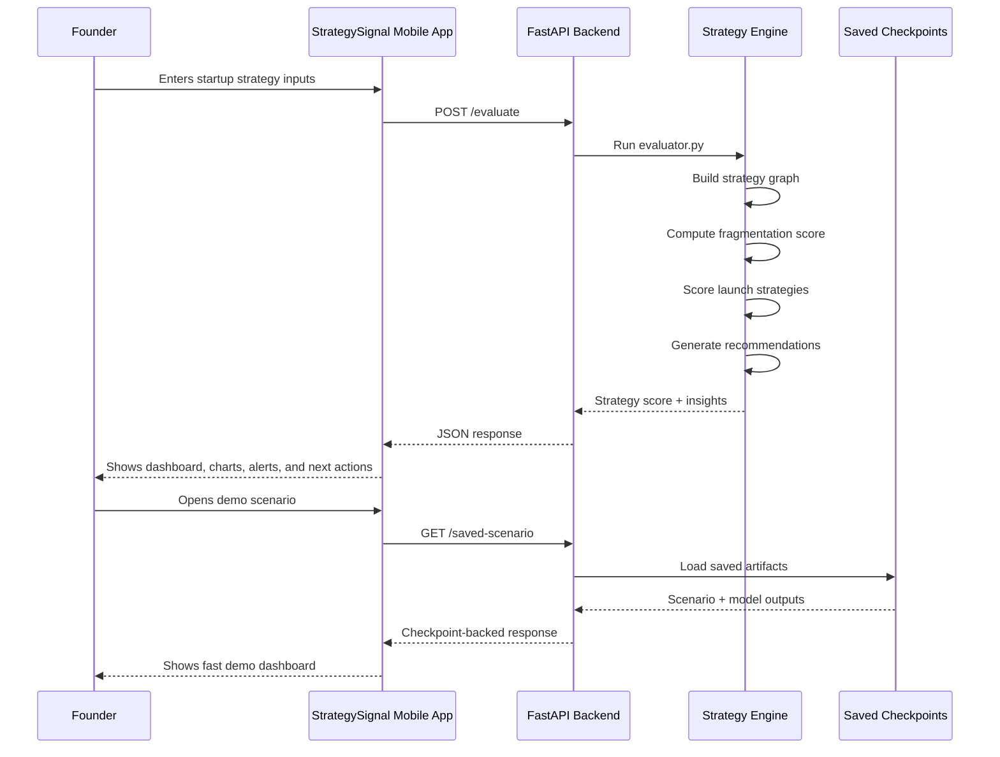
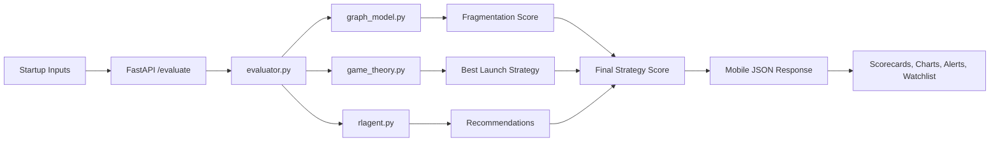

# StrategySignal


StrategySignal is the final hackathon submission as one branch and one repo: a Newly / Expo mobile app at the root, backed by a Python FastAPI strategy engine in `rendor/`.

The mobile app captures startup inputs and surfaces scorecards, charts, watchlists, and recommendations. The backend evaluates those strategies using graph analysis, payoff-based game theory, learned checkpoints, and an experimental RL action layer.

## What This Repo Contains

- Newly / Expo mobile app in the root project
- Python FastAPI backend in `rendor/`
- graph-based structural analysis for startup plans
- game-theory payoff scoring for launch posture selection
- saved heuristic, predictive, RL, and scenario checkpoints for demo flows

## Architecture Overview

StrategySignal uses a mobile-first architecture. The Newly / Expo app handles the user experience, while the Python FastAPI backend in `rendor/` handles the strategy evaluation logic.

The mobile app does not run the ML, graph, or game-theory logic directly. It sends startup strategy inputs to the backend, and the backend returns a structured JSON response that the app displays as scorecards, charts, watchlists, alerts, and recommendations.



## Request Flow



## System Layers

| Layer | Technology | Role |
| --- | --- | --- |
| Mobile UI | Newly / Expo / React Native | Collects founder inputs and displays the strategy dashboard |
| API Client | `utils/api.ts` | Sends requests from the mobile app to the backend |
| Backend API | FastAPI in `rendor/api.py` | Exposes `/evaluate`, `/saved-scenario`, and health endpoints |
| Strategy Engine | Python modules in `rendor/` | Runs graph analysis, payoff scoring, recommendations, and checkpoint loading |
| Saved Artifacts | JSON + Joblib files in `rendor/models/` | Support fast demo scenarios without retraining |
| Data Helpers | `market_data.py` + JSON data | Support competitor / brand proxy lookup |

## Evaluation Pipeline



## Final Submission Layout

```text
ml hackathon/
|-- app/
|-- components/
|-- assets/
|-- constants/
|-- contexts/
|-- styles/
|-- utils/
|-- package.json
|-- app.json
|-- README.md
|-- rendor/
|   |-- api.py
|   |-- dataset_loader.py
|   |-- evaluator.py
|   |-- game_theory.py
|   |-- gametheory.py
|   |-- graph_model.py
|   |-- market_data.py
|   |-- predictive_models.py
|   |-- reinforcement_model.py
|   |-- rlagent.py
|   |-- strategy_signal_rl.py
|   |-- requirements.txt
|   |-- README.md
|   |-- data/
|   |   |-- competitors_by_category.json
|   |-- models/
|   |   |-- heuristic_checkpoint.json
|   |   |-- strategysignal_predictive.joblib
|   |   |-- strategysignal_rl_policy.json
|   |   |-- scenario_snapshot.json
```

## How It Works

1. The mobile app collects product, channel, milestone, and competitive inputs.
2. The app posts those inputs to the FastAPI backend in `rendor/api.py`.
3. The backend evaluates the strategy using graph structure, launch payoff scoring, and recommendation logic.
4. Saved checkpoint artifacts in `rendor/models/` support fast demo playback without retraining.
5. The mobile UI turns the response into scorecards, trends, and next-step recommendations.

## Mobile App

The root app is a Newly / Expo Router project using React Native and TypeScript.

Key paths:

- `app/`: route-based screens
- `components/`: reusable mobile UI building blocks
- `utils/api.ts`: backend client used by the input flow
- `app.json`: Expo configuration and backend URL fallback

Run locally:

```bash
npm install
npm run dev
```

Useful scripts:

- `npm run ios`
- `npm run android`
- `npm run web`
- `npm run lint`

## Python Backend

The backend bundle lives in `rendor/` and exposes the evaluation endpoints consumed by the mobile app.

Main endpoints:

- `GET /`
- `GET /health`
- `POST /evaluate`
- `GET /saved-scenario`

Run locally:

```bash
cd rendor
pip install -r requirements.txt
uvicorn api:app --reload
```

If you prefer to stay at the repo root:

```bash
uvicorn api:app --reload --app-dir rendor
```

Backend-specific setup and deployment notes live in `rendor/README.md`.

## Mobile To Backend Configuration

The mobile app reads its backend URL in this order:

1. `EXPO_PUBLIC_API_BASE_URL`
2. `expo.extra.backendUrl` in `app.json`

If the backend enables API-key protection, the mobile app can also send:

- `EXPO_PUBLIC_STRATEGYSIGNAL_API_KEY`

The backend supports these environment variables:

- `STRATEGYSIGNAL_API_KEY`
- `STRATEGYSIGNAL_CORS_ORIGINS`

## Strategy Engine Summary

The Python backend evaluates startup strategies with four layers:

- graph analysis for fragmentation and structural bottlenecks
- game-theory payoff scoring for aggressive, delayed, and niche launch options
- predictive checkpoints for demo-ready heuristic and model outputs
- an experimental RL policy layer for ranked next actions

Core backend modules:

- `rendor/evaluator.py`
- `rendor/graph_model.py`
- `rendor/game_theory.py`
- `rendor/predictive_models.py`
- `rendor/reinforcement_model.py`
- `rendor/strategy_signal_rl.py`
- `rendor/rlagent.py`

## Demo Data

The backend can run from saved artifacts in `rendor/models/`, or it can rebuild state from the Kaggle-style archive tables:

- `customers.csv`
- `products.csv`
- `campaigns.csv`
- `events.csv`
- `transactions.csv`

Those CSVs are not committed in this repo. Use the archive folder locally when regenerating scenarios, or use the saved scenario checkpoint for demos.

## Submission Message

StrategySignal is a mobile startup-strategy dashboard built with Newly. The mobile app calls a Python FastAPI backend in `rendor/`. That backend evaluates startup strategies using graph analysis, game-theory payoff scoring, predictive checkpoints, and experimental RL-ranked actions.
