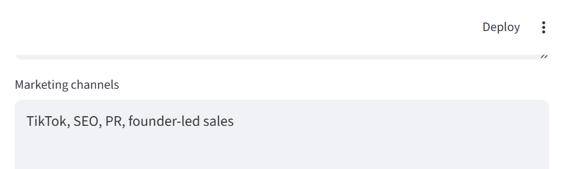
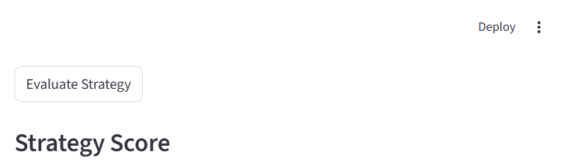
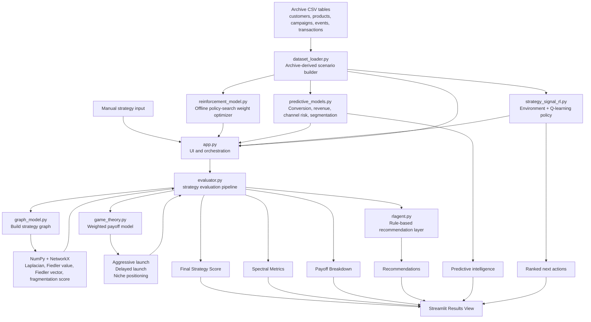

# Startup Strategy Evaluator


Startup Strategy Evaluator is now a StrategySignal-style founder dashboard that turns a startup plan into a scored decision model. It combines spectral graph theory, payoff-based competitive analysis, predictive ML, and an experimental trained RL policy to help teams spot bottlenecks, choose a launch posture, monitor competitor pressure, and identify the next best strategic moves.

Think of it as a stock-analysis dashboard for startup strategy: instead of tracking share price, it tracks launch readiness, market pressure, product risk, and recommended next moves.

The app now supports two workflows:

- manual strategy entry for quick experimentation
- archive-backed scenario generation from the Kaggle marketing and e-commerce dataset

In archive mode, the pipeline now trains three separate layers from monthly dataset episodes:

- learned heuristics for the core evaluator inputs
- predictive ML models for conversion, revenue, weak-channel risk, and customer segmentation
- a reinforcement-learning environment plus Q-learning policy for next-best-action ranking

The current UI is now based on the dashboard layout style used in `streamlit/demo-stockpeers`: wide layout, bordered control and insight panels, metric cards, Altair visualizations, and a dedicated `streamlit_app.py` entrypoint.

Current archive-mode screens include:

- a StrategySignal-style home dashboard
- stock-style strategy history charts
- brand / competitor proxy watchlist and threat scoring
- alert cards for weak channels and positioning risks
- an ML + RL intelligence view with predictive outputs and policy actions
- optimizer diagnostics and checkpoint visibility

## Hackathon Pitch

Founders make high-stakes launch decisions with incomplete information. This project reframes startup planning as a structured decision system: model the business as a graph, score launch options under competitive pressure, and return practical recommendations instead of vague advice.

The core idea is simple: take a messy strategy conversation and convert it into a measurable evaluation pipeline.

Current founder inputs:

- product features
- marketing channels
- competitors
- milestones
- marketing strength
- product readiness
- competition intensity

Current outputs:

- overall strategy score
- best launch strategy from the payoff model
- payoff breakdown across strategy options
- Fiedler value and fragmentation score from the graph
- action-oriented recommendations
- brand / competitor proxy watchlist and threat responses
- alert feed for risk conditions
- predictive conversion and revenue signals
- RL-ranked next actions

## Archive Dataset Mode

The repository can now read the Kaggle-style archive directly from a folder containing:

- `customers.csv`
- `products.csv`
- `campaigns.csv`
- `events.csv`
- `transactions.csv`

By default, the app looks for those files in `~/Downloads/archive` on the local machine.

The five Kaggle CSV files are not included in the repository. Download them separately and point the app at their folder, or use the saved checkpoint scenario after generating a snapshot locally. After running archive mode once, the app can reuse generated model checkpoints from the `models/` folder for faster demos.

The dataset-backed mode maps the tables into the current MVP like this:

- product categories become product pillars
- traffic sources and campaign channels become marketing channels
- top product brands become competitor proxies
- product launch quarters become timeline milestones
- purchase behavior, uplift, refunds, premium share, loyalty mix, brand diversity, and channel mix become the numeric strategy scores

This keeps the current evaluator intact while grounding the demo in real tabular data.

## Learned Heuristics, Predictive ML, And RL

Archive scoring now uses a separate optimizer module that learns weights for each heuristic from many monthly slices of the dataset.

The current learned heuristics are:

- `Marketing strength`: learned from conversion, campaign, traffic, and customer-acquisition signals
- `Product readiness`: learned from revenue, refund, pricing, launch, and loyalty signals
- `Competition intensity`: learned from brand, channel, traffic concentration, and pressure signals

`reinforcement_model.py` is not a full RL agent. It is an offline heuristic-weight optimizer.

On top of those learned evaluator inputs, the app now trains:

- `predictive_models.py` for conversion probability, next-period revenue, weak-channel detection, and customer segmentation
- `strategy_signal_rl.py` for an experimental environment with `reset()` and `step()` plus a Q-learning policy over strategy actions

`rlagent.py` remains a rule-based recommendation layer that reacts to the final evaluator output.

Generated artifacts are persisted to:

- `models/heuristic_checkpoint.json`
- `models/strategysignal_predictive.joblib`
- `models/strategysignal_rl_policy.json`

The JSON checkpoint files store lightweight learned heuristic and RL policy outputs so the app can reuse previous archive-mode results without retraining every run.

The predictive scikit-learn models are stored separately as a `.joblib` artifact because trained estimators are not JSON-serializable.

## Demo Snapshots

| Strategy input view | Evaluation output |
| --- | --- |
|  |  |

## Why This Is Interesting

- It treats startup execution as a connected system rather than a checklist.
- It uses spectral signals to identify fragmentation and structural weakness.
- It introduces competitive reasoning with a simple game-theory payoff model.
- It grounds the experience in real archive data instead of only manual founder inputs.
- It moves beyond fixed scoring by adding trained heuristics, predictive ML, and an experimental RL policy surface.

## UN Sustainable Development Goal Alignment

This project primarily aligns with **UN Sustainable Development Goal 9: Industry, Innovation and Infrastructure**.

Startup Strategy Evaluator supports innovation by giving founders a structured decision-support system for evaluating product timelines, marketing strategy, market risk, and growth opportunities. Instead of relying only on intuition, early-stage teams can use data-driven scoring, predictive modeling, graph analysis, and strategy recommendations to make better launch decisions.

The project also has a secondary connection to **Goal 8: Decent Work and Economic Growth**, because stronger startup decision-making can support entrepreneurship, business growth, and future job creation.

## Product Vision

The broader concept goes beyond the current MVP. The long-term app should allow founders to enter:

- marketing strategy
- product timeline
- budget
- target market
- competitors
- milestones
- traction metrics

Then evaluate the plan using:

- game theory for competitor response and payoff tradeoffs
- reinforcement learning for action selection over repeated simulations
- spectral graph theory for structure and dependency analysis
- Fiedler vector and Cheeger-style approximation for fragmentation and segmentation detection

## Core Flow

1. The founder either enters a strategy manually or loads an archive-derived scenario.
2. `dataset_loader.py` transforms the CSV tables into monthly features, channels, competitor proxies, milestones, and scenario summaries.
3. `reinforcement_model.py` learns heuristic weights from those monthly episodes and produces optimized heuristic scores.
4. `predictive_models.py` trains conversion, revenue, channel-risk, and customer-segmentation models.
5. `strategy_signal_rl.py` builds a monthly environment and trains a Q-learning policy over startup actions.
6. The evaluator builds a strategy graph from features, channels, competitors, and milestones.
7. The graph module computes the normalized Laplacian, Fiedler value, Fiedler vector, and fragmentation score.
8. The game-theory module scores several launch strategies.
9. The evaluator combines numeric inputs and the spectral penalty derived from the fragmentation score into a final score.
10. The dashboard surfaces recommendations, alerts, competitor pressure, ML forecasts, and RL-ranked next moves.

## Architecture Diagram



## Repository Layout

This repository currently uses a flat layout:

```text
ml hackathon/
|-- app.py
|-- streamlit_app.py
|-- dataset_loader.py
|-- evaluator.py
|-- game_theory.py
|-- gametheory.py
|-- graph_model.py
|-- reinforcement_model.py
|-- predictive_models.py
|-- market_data.py
|-- rlagent.py
|-- strategy_signal_rl.py
|-- data/
|   |-- competitors_by_category.json
|-- models/
|   |-- heuristic_checkpoint.json
|   |-- strategysignal_predictive.joblib
|   |-- strategysignal_rl_policy.json
|   |-- scenario_snapshot.json
|-- .streamlit/
|   |-- config.toml
|-- assets/
|   |-- app-inputs.png
|   |-- app-results.png
|-- README.md
|-- requirements.txt
```

Module responsibilities:

- `app.py`: stockpeers-inspired dashboard implementation and rendering helpers.
- `streamlit_app.py`: Streamlit entrypoint matching the base repository structure.
- `dataset_loader.py`: archive ingestion, monthly feature engineering, and scenario building.
- `evaluator.py`: central orchestration for scoring and recommendations.
- `graph_model.py`: graph construction and spectral analysis.
- `game_theory.py`: canonical payoff model for launch strategies.
- `gametheory.py`: compatibility shim for the older module name.
- `reinforcement_model.py`: offline heuristic-weight optimizer that learns feature weights for archive heuristics.
- `predictive_models.py`: trained scikit-learn models for conversion, revenue, weak-channel risk, and customer segmentation.
- `market_data.py`: category lookup helper for manual-mode competitor suggestions.
- `rlagent.py`: rule-based recommendation logic.
- `strategy_signal_rl.py`: environment-driven RL trainer and ranked action policy.
- `data/competitors_by_category.json`: curated category-to-market-leader mapping used in manual mode.
- `models/`: persisted heuristic, predictive, RL, and scenario snapshot artifacts.
- `.streamlit/config.toml`: dashboard theme configuration.
- `requirements.txt`: MVP dependency list.

## Library Overview

| Library | Role in the project |
| --- | --- |
| `streamlit` | Runs the StrategySignal-style interface with tabs, metric cards, watchlists, alerts, and results panels. |
| `altair` | Powers the stock-style history charts, payoff visuals, threat charts, and optimizer views. |
| `numpy` | Handles linear algebra for Laplacian eigenvalue and eigenvector computation. |
| `networkx` | Builds the startup strategy graph and produces the normalized Laplacian matrix. |
| `scikit-learn` | Trains the predictive conversion, revenue, channel-risk, and segmentation models. |
| `pandas` | Loads the archive CSV files and derives strategy inputs, time series, watchlists, alerts, and model features from the dataset. |

## Dataset Mapping

The Kaggle dataset is a good fit for this project because it already contains the entities needed to simulate startup strategy decisions.

| Dataset table | Used for |
| --- | --- |
| `customers.csv` | customer segmentation and future state features |
| `products.csv` | product pillars, brand proxies, launch milestones |
| `campaigns.csv` | channel mix and campaign uplift |
| `events.csv` | funnel behavior, traffic mix, and purchase rate |
| `transactions.csv` | revenue and refund signals for readiness and reward proxies |

In the current MVP, explicit competitor data does not exist in the archive, so the app uses top product brands as brand / competitor proxies. That keeps the graph connected without inventing a fake competitor table.

## How The MVP Works

### Strategy graph

The graph layer creates nodes for:

- product features
- marketing channels
- competitors
- milestones

The MVP now uses typed weighted edges instead of a fully connected graph. Channels connect to features, features connect to milestones, competitors connect to features and channels, and same-type nodes are lightly linked in sequence to avoid disconnected islands.

Edge weights are still heuristic, not learned. They are based on node type and simple token overlap, so the graph is more structurally meaningful than a complete graph but still an MVP approximation.

### Spectral analysis

The graph module computes:

- normalized graph Laplacian
- eigenvalues and eigenvectors
- Fiedler value
- Fiedler vector
- a normalized fragmentation score derived from the Fiedler value and clamped to `[0, 1]`

These metrics act as a structural health signal for the startup plan. The graph module outputs a fragmentation score, the evaluator uses it as the spectral penalty input, and the UI treats it as a bottleneck-risk indicator. The fragmentation score is a simple MVP proxy, not a direct Cheeger conductance calculation.

### Game-theory payoff model

The payoff model estimates three strategic options:

- Aggressive launch
- Delayed launch
- Niche positioning

Each payoff is computed from a weighted combination of:

- marketing strength
- product readiness
- competition intensity

### Final strategy score

The evaluator computes a base score from the numeric inputs, subtracts a spectral penalty derived from the fragmentation score, and clamps the final result to a `0-100` range.

### Recommendations

The recommendation layer converts the score and best strategy label into guidance such as:

- improve positioning and acquisition channels
- reduce fragmentation across milestones and go-to-market execution
- delay launch until product readiness improves
- focus on a narrower initial segment

## Run Locally

Install dependencies:

```bash
pip install -r requirements.txt
```

Start the app:

```bash
streamlit run streamlit_app.py
```

If the dataset is stored outside the default location, switch the app to `Archive dataset scenario` mode and point the archive path field at the folder containing the five CSV files.

The first archive-mode run may take longer because the app derives monthly features and writes model checkpoints. Later runs can reuse saved artifacts from the `models/` folder.

## Known MVP Approximation

The current system is a hackathon MVP. The ML, graph, and RL components are intentionally lightweight so the full strategy pipeline can run locally and be explained clearly. The current goal is not to perfectly model startup outcomes, but to demonstrate how startup strategy can be converted into a structured decision system using tabular data, graph features, payoff modeling, and learned action ranking.

## Current Limitation

The project now has two separate learning layers that should not be conflated:

- `reinforcement_model.py` optimizes heuristic weights offline and is not a true RL agent
- `strategy_signal_rl.py` contains the experimental Q-learning environment and policy
- `rlagent.py` is still a rule-based recommender that reacts to the final score, fragmentation score, and best strategy label

The graph layer is also still approximate. The typed edges are more meaningful than a complete graph, but they are still based on hand-built structure and token overlap rather than observed dependency graphs.

## Roadmap

1. Move the analytical modules into a dedicated `strategy_engine/` package.
2. Replace heuristic typed edges with learned or data-derived edge weights from observed user, product, campaign, and transaction relationships.
3. Add budget, target market, and traction metrics to the UI and evaluator.
4. Persist scenarios and evaluations with SQLite.
5. Expand the experimental Q-learning environment into a richer strategy simulation with budget, timing, market response, and competitor reaction dynamics.
6. Expose the evaluation engine through FastAPI when the prototype grows.
