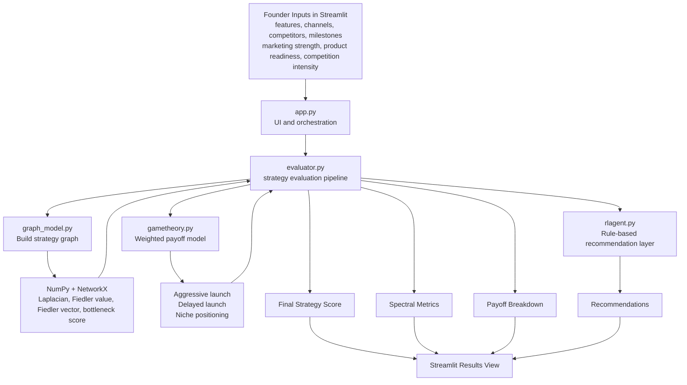

# Startup Strategy Evaluator


Startup Strategy Evaluator is a founder-facing MVP that turns a startup plan into a scored decision model. It combines spectral graph theory, payoff-based competitive analysis, and a rule-based recommendation layer to help teams spot bottlenecks, choose a launch posture, and identify the next best strategic moves.

## Hackathon Pitch

Founders make high-stakes launch decisions with incomplete information. This project reframes startup planning as a structured decision system: model the business as a graph, score launch options under competitive pressure, and return practical recommendations instead of vague advice.

The core idea is simple: take a messy strategy conversation and convert it into a measurable evaluation pipeline.

Current founder inputs:

- product features
- marketing channels
- competitors
- milestones
- marketing strength
- product readiness
- competition intensity

Current outputs:

- overall strategy score
- best launch strategy from the payoff model
- payoff breakdown across strategy options
- Fiedler value and bottleneck score from the graph
- action-oriented recommendations

## Demo Snapshots

| Strategy input view | Evaluation output |
|---|---|
|  |  |

## Why This Is Interesting

- It treats startup execution as a connected system rather than a checklist.
- It uses spectral signals to identify fragmentation and structural weakness.
- It introduces competitive reasoning with a simple game-theory payoff model.
- It creates a path from heuristic scoring today to simulation-driven reinforcement learning later.

## Product Vision

The broader concept goes beyond the current MVP. The long-term app should allow founders to enter:

- marketing strategy
- product timeline
- budget
- target market
- competitors
- milestones
- traction metrics

Then evaluate the plan using:

- game theory for competitor response and payoff tradeoffs
- reinforcement learning for action selection over repeated simulations
- spectral graph theory for structure and dependency analysis
- Fiedler vector and Cheeger-style approximation for bottleneck and segmentation detection

## Core Flow

1. The founder submits startup strategy details in Streamlit.
2. The evaluator builds a strategy graph from features, channels, competitors, and milestones.
3. The graph module computes the normalized Laplacian, Fiedler value, Fiedler vector, and bottleneck score.
4. The game-theory module scores several launch strategies.
5. The evaluator combines numeric inputs and the spectral penalty into a final score.
6. The recommendation layer returns next-step suggestions based on score quality and strategic posture.

## Architecture Diagram



## Repository Layout

This repository currently uses a flat layout:

```text
ml hackathon/
|-- app.py
|-- evaluator.py
|-- gametheory.py
|-- graph_model.py
|-- rlagent.py
|-- assets/
|   |-- app-inputs.png
|   |-- app-results.png
|-- README.md
|-- requirements.txt
```

Module responsibilities:

- `app.py`: Streamlit interface and user interaction flow.
- `evaluator.py`: central orchestration for scoring and recommendations.
- `graph_model.py`: graph construction and spectral analysis.
- `gametheory.py`: heuristic payoff scoring for launch strategies.
- `rlagent.py`: rule-based recommendation logic.
- `requirements.txt`: MVP dependency list.

## Library Overview

| Library | Role in the project |
|---|---|
| `streamlit` | Runs the MVP interface with text areas, sliders, buttons, and results panels. |
| `numpy` | Handles linear algebra for Laplacian eigenvalue and eigenvector computation. |
| `networkx` | Builds the startup strategy graph and produces the normalized Laplacian matrix. |
| `scikit-learn` | Included for future model expansion, such as clustering, feature engineering, or learned evaluators. |
| `pandas` | Included for future scenario datasets, benchmarking tables, or saved strategy evaluations. |

## How The MVP Works

### Strategy graph

The graph layer creates nodes for:

- product features
- marketing channels
- competitors
- milestones

The current MVP connects all nodes with a default edge weight. That is intentionally simple and keeps the prototype easy to explain, but future versions should replace it with explicit relationships such as dependency, overlap, influence, or direct competition.

### Spectral analysis

The graph module computes:

- normalized graph Laplacian
- eigenvalues and eigenvectors
- Fiedler value
- Fiedler vector
- bottleneck score using `sqrt(2 * fiedler_value)`

These metrics act as a structural health signal for the startup plan.

### Game-theory payoff model

The payoff model estimates three strategic options:

- Aggressive launch
- Delayed launch
- Niche positioning

Each payoff is computed from a weighted combination of:

- marketing strength
- product readiness
- competition intensity

### Final strategy score

The evaluator computes a base score from the numeric inputs, subtracts a spectral penalty derived from the bottleneck score, and clamps the final result to a `0-100` range.

### Recommendations

The recommendation layer converts the score and best strategy label into guidance such as:

- improve positioning and acquisition channels
- reduce fragmentation across milestones and go-to-market execution
- delay launch until product readiness improves
- focus on a narrower initial segment

## Run Locally

Install dependencies:

```bash
pip install -r requirements.txt
```

Start the app:

```bash
streamlit run app.py
```

## Current Limitation

The current `rlagent.py` module is not a true reinforcement-learning agent yet. It is a rule-based recommender that reacts to the final score, bottleneck score, and best strategy label.

To turn this into real RL, the next version needs:

- a state representation of startup strategy plus market conditions
- a defined action space such as reallocate budget, delay launch, or reposition product
- a reward function tied to simulated or real outcomes
- repeated strategy simulation so a policy can learn over time

## Roadmap

1. Move the analytical modules into a dedicated `strategy_engine/` package.
2. Replace the fully connected graph with richer, typed edge generation.
3. Add budget, target market, and traction metrics to the UI and evaluator.
4. Persist scenarios and evaluations with SQLite.
5. Introduce a real strategy simulation environment for reinforcement learning.
6. Expose the evaluation engine through FastAPI when the prototype grows.