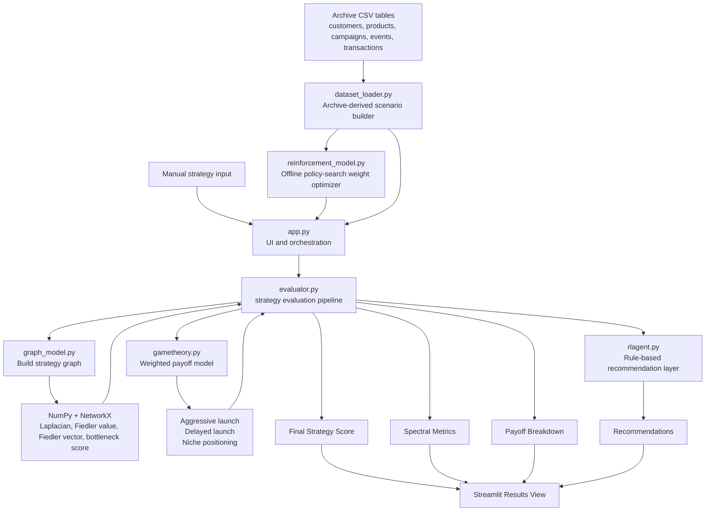

# Startup Strategy Evaluator


Startup Strategy Evaluator is a founder-facing MVP that turns a startup plan into a scored decision model. It combines spectral graph theory, payoff-based competitive analysis, and a rule-based recommendation layer to help teams spot bottlenecks, choose a launch posture, and identify the next best strategic moves.

The app now supports two workflows:

- manual strategy entry for quick experimentation
- archive-backed scenario generation from the Kaggle marketing and e-commerce dataset

In archive mode, the numeric heuristics are no longer fixed constants. They are learned by an offline reinforcement-style policy search that tunes feature weights across monthly dataset episodes.

The current UI is now based on the dashboard layout style used in `streamlit/demo-stockpeers`: wide layout, bordered control and insight panels, metric cards, Altair visualizations, and a dedicated `streamlit_app.py` entrypoint.

## Hackathon Pitch

Founders make high-stakes launch decisions with incomplete information. This project reframes startup planning as a structured decision system: model the business as a graph, score launch options under competitive pressure, and return practical recommendations instead of vague advice.

The core idea is simple: take a messy strategy conversation and convert it into a measurable evaluation pipeline.

Current founder inputs:

- product features
- marketing channels
- competitors
- milestones
- marketing strength
- product readiness
- competition intensity

Current outputs:

- overall strategy score
- best launch strategy from the payoff model
- payoff breakdown across strategy options
- Fiedler value and bottleneck score from the graph
- action-oriented recommendations

## Archive Dataset Mode

The repository can now read the Kaggle-style archive directly from a folder containing:

- `customers.csv`
- `products.csv`
- `campaigns.csv`
- `events.csv`
- `transactions.csv`

By default, the app looks for those files in `~/Downloads/archive` on the local machine.

The dataset-backed mode maps the tables into the current MVP like this:

- product categories become product pillars
- traffic sources and campaign channels become marketing channels
- top product brands become competitor proxies
- product launch quarters become timeline milestones
- purchase behavior, uplift, refunds, premium share, loyalty mix, brand diversity, and channel mix become the numeric strategy scores

This keeps the current evaluator intact while grounding the demo in real tabular data.

## Reinforcement-Optimized Heuristics

Archive scoring now uses a separate optimizer module that learns weights for each heuristic from many monthly slices of the dataset.

The current learned heuristics are:

- `Marketing strength`: learned from conversion, campaign, traffic, and customer-acquisition signals
- `Product readiness`: learned from revenue, refund, pricing, launch, and loyalty signals
- `Competition intensity`: learned from brand, channel, traffic concentration, and pressure signals

This is still not a full environment-based RL system, but it is a meaningful step beyond hand-tuned scoring because the weights are learned from observed dataset episodes instead of being hardcoded.

## Demo Snapshots

| Strategy input view | Evaluation output |
|---|---|
|  |  |

## Why This Is Interesting

- It treats startup execution as a connected system rather than a checklist.
- It uses spectral signals to identify fragmentation and structural weakness.
- It introduces competitive reasoning with a simple game-theory payoff model.
- It creates a path from heuristic scoring today to simulation-driven reinforcement learning later.

## Product Vision

The broader concept goes beyond the current MVP. The long-term app should allow founders to enter:

- marketing strategy
- product timeline
- budget
- target market
- competitors
- milestones
- traction metrics

Then evaluate the plan using:

- game theory for competitor response and payoff tradeoffs
- reinforcement learning for action selection over repeated simulations
- spectral graph theory for structure and dependency analysis
- Fiedler vector and Cheeger-style approximation for bottleneck and segmentation detection

## Core Flow

1. The founder either enters a strategy manually or loads an archive-derived scenario.
2. `dataset_loader.py` transforms the CSV tables into monthly features, channels, competitor proxies, milestones, and scenario summaries.
3. `reinforcement_model.py` learns heuristic weights from those monthly episodes and produces optimized heuristic scores.
4. The evaluator builds a strategy graph from features, channels, competitors, and milestones.
5. The graph module computes the normalized Laplacian, Fiedler value, Fiedler vector, and bottleneck score.
6. The game-theory module scores several launch strategies.
7. The evaluator combines numeric inputs and the spectral penalty into a final score.
8. The recommendation layer returns next-step suggestions based on score quality and strategic posture.

## Architecture Diagram



## Repository Layout

This repository currently uses a flat layout:

```text
ml hackathon/
|-- app.py
|-- streamlit_app.py
|-- dataset_loader.py
|-- evaluator.py
|-- gametheory.py
|-- graph_model.py
|-- reinforcement_model.py
|-- rlagent.py
|-- .streamlit/
|   |-- config.toml
|-- assets/
|   |-- app-inputs.png
|   |-- app-results.png
|-- README.md
|-- requirements.txt
```

Module responsibilities:

- `app.py`: stockpeers-inspired dashboard implementation and rendering helpers.
- `streamlit_app.py`: Streamlit entrypoint matching the base repository structure.
- `dataset_loader.py`: archive ingestion, monthly feature engineering, and scenario building.
- `evaluator.py`: central orchestration for scoring and recommendations.
- `graph_model.py`: graph construction and spectral analysis.
- `gametheory.py`: heuristic payoff scoring for launch strategies.
- `reinforcement_model.py`: offline policy-search optimizer that learns feature weights for archive heuristics.
- `rlagent.py`: rule-based recommendation logic.
- `.streamlit/config.toml`: dashboard theme configuration.
- `requirements.txt`: MVP dependency list.

## Library Overview

| Library | Role in the project |
|---|---|
| `streamlit` | Runs the MVP interface with text areas, sliders, buttons, and results panels. |
| `altair` | Powers the stockpeers-style payoff, scorecard, and optimizer charts. |
| `numpy` | Handles linear algebra for Laplacian eigenvalue and eigenvector computation. |
| `networkx` | Builds the startup strategy graph and produces the normalized Laplacian matrix. |
| `scikit-learn` | Included for future model expansion beyond the current custom policy-search optimizer. |
| `pandas` | Loads the archive CSV files and derives strategy inputs and summary metrics from the dataset. |

## Dataset Mapping

The Kaggle dataset is a good fit for this project because it already contains the entities needed to simulate startup strategy decisions.

| Dataset table | Used for |
|---|---|
| `customers.csv` | customer segmentation and future state features |
| `products.csv` | product pillars, brand proxies, launch milestones |
| `campaigns.csv` | channel mix and campaign uplift |
| `events.csv` | funnel behavior, traffic mix, and purchase rate |
| `transactions.csv` | revenue and refund signals for readiness and reward proxies |

In the current MVP, explicit competitor data does not exist in the archive, so the app uses top product brands as competitor proxies. That keeps the graph connected without inventing a fake competitor table.

## How The MVP Works

### Strategy graph

The graph layer creates nodes for:

- product features
- marketing channels
- competitors
- milestones

The current MVP connects all nodes with a default edge weight. That is intentionally simple and keeps the prototype easy to explain, but future versions should replace it with explicit relationships such as dependency, overlap, influence, or direct competition.

### Spectral analysis

The graph module computes:

- normalized graph Laplacian
- eigenvalues and eigenvectors
- Fiedler value
- Fiedler vector
- bottleneck score derived from `1 - sqrt(fiedler_value)` (clamped to `[0, 1]`, so a fragmented graph approaches `1` and a well-connected graph approaches `0`)

These metrics act as a structural health signal for the startup plan.

### Game-theory payoff model

The payoff model estimates three strategic options:

- Aggressive launch
- Delayed launch
- Niche positioning

Each payoff is computed from a weighted combination of:

- marketing strength
- product readiness
- competition intensity

### Final strategy score

The evaluator computes a base score from the numeric inputs, subtracts a spectral penalty derived from the bottleneck score, and clamps the final result to a `0-100` range.

### Recommendations

The recommendation layer converts the score and best strategy label into guidance such as:

- improve positioning and acquisition channels
- reduce fragmentation across milestones and go-to-market execution
- delay launch until product readiness improves
- focus on a narrower initial segment

## Run Locally

Install dependencies:

```bash
pip install -r requirements.txt
```

Start the app:

```bash
streamlit run streamlit_app.py
```

If the dataset is stored outside the default location, switch the app to `Archive dataset scenario` mode and point the archive path field at the folder containing the five CSV files.

## Current Limitation

The current `rlagent.py` module is not a true reinforcement-learning agent yet. It is a rule-based recommender that reacts to the final score, bottleneck score, and best strategy label.

To turn this into real RL, the next version needs:

- a state representation of startup strategy plus market conditions
- a defined action space such as reallocate budget, delay launch, or reposition product
- a reward function tied to simulated or real outcomes
- repeated strategy simulation so a policy can learn over time

## Roadmap

1. Move the analytical modules into a dedicated `strategy_engine/` package.
2. Replace the fully connected graph with richer, typed edge generation.
3. Add budget, target market, and traction metrics to the UI and evaluator.
4. Persist scenarios and evaluations with SQLite.
5. Introduce a real strategy simulation environment for reinforcement learning.
6. Expose the evaluation engine through FastAPI when the prototype grows.