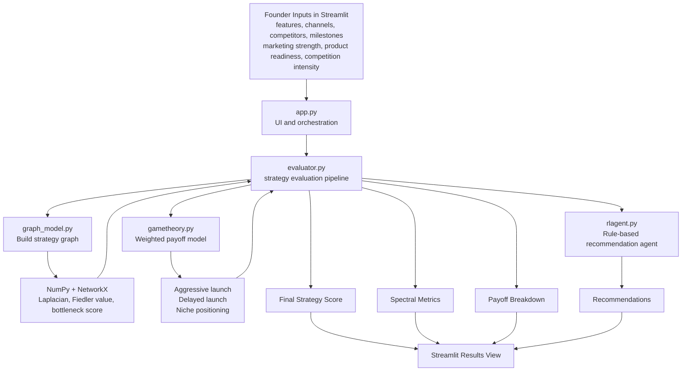

# Startup Strategy Evaluator

Startup Strategy Evaluator is an MVP decision-support app for founders. It combines startup strategy inputs with graph analysis, game-theory style payoff scoring, and a rule-based recommendation layer to estimate how strong a launch plan looks and where it may break down.

The project is based on the idea of evaluating:

- marketing strategy
- product timeline
- competitors
- milestones
- market positioning

with a mix of:

- spectral graph theory
- payoff modeling inspired by game theory
- a recommendation agent inspired by reinforcement learning

## Vision

The broader product concept is a founder-facing strategy simulator where users enter:

- marketing strategy
- product timeline
- budget
- target market
- competitors
- milestones
- traction metrics

The system then evaluates the plan using:

- game theory to estimate competitor responses and payoff tradeoffs
- reinforcement learning to learn which strategy actions improve outcomes over time
- spectral graph theory to model relationships across the product, market, competitors, and customer segments
- the Fiedler vector and a Cheeger-style bottleneck approximation to identify weak links, fragmentation risk, and segmentation opportunities

## Current MVP In This Repo

The checked-in code implements a smaller MVP than the full vision above.

Current user inputs:

- product features
- marketing channels
- competitors
- product milestones
- marketing strength score
- product readiness score
- competition intensity score

Current outputs:

- overall strategy score
- best launch posture from the payoff model
- payoff breakdown across strategic options
- Fiedler value and bottleneck score from the strategy graph
- plain-language recommendations

Important limitation: the current `rlagent.py` module is not true reinforcement learning yet. It is a rule-based recommendation layer that uses the evaluation score, bottleneck score, and best strategy label to generate suggestions.

## Core Flow

1. A founder enters startup strategy details in the Streamlit interface.
2. The evaluator builds a strategy graph from features, channels, competitors, and milestones.
3. The graph module computes a normalized Laplacian, the Fiedler value/vector, and a Cheeger-style bottleneck approximation.
4. The game-theory module scores a small set of strategic launch options.
5. The evaluator combines numeric inputs with the spectral bottleneck penalty to produce a final score.
6. The recommendation module returns action-oriented guidance based on that score and the best strategic posture.

## Architecture Diagram



## Repository Layout

This repository currently uses a flat layout:

```text
ml hackathon/
|-- app.py
|-- evaluator.py
|-- gametheory.py
|-- graph_model.py
|-- rlagent.py
|-- requirements.txt
```

Module responsibilities:

- `app.py`: Streamlit UI for collecting inputs and displaying results.
- `evaluator.py`: central orchestration layer that combines spectral analysis, payoff scoring, and recommendation generation.
- `graph_model.py`: graph construction and spectral analysis.
- `gametheory.py`: simple heuristic payoff model for launch strategies.
- `rlagent.py`: rule-based action recommendation layer.
- `requirements.txt`: Python dependencies for the MVP.

## Library Overview

### Streamlit

Used for the MVP frontend. It provides the sliders, text areas, buttons, score metric, and JSON output that make the app easy to demo without building a separate frontend.

### NumPy

Used for numerical linear algebra inside the spectral analysis pipeline. The graph Laplacian eigen-decomposition is computed with NumPy.

### NetworkX

Used to build and analyze the startup strategy graph. The graph stores nodes for features, channels, competitors, and milestones, then produces the normalized Laplacian used for spectral analysis.

### scikit-learn

Included in `requirements.txt`, but not yet used directly in the current checked-in modules. It is a sensible future dependency for clustering, feature engineering, or predictive modeling once the app moves beyond heuristic scoring.

### pandas

Included in `requirements.txt`, but not yet used directly in the current checked-in modules. It would fit naturally for loading startup profiles, benchmarking strategy scenarios, or storing evaluation datasets.

## How The MVP Scoring Works

### 1. Strategy graph

The graph layer creates nodes for:

- product features
- marketing channels
- competitors
- milestones

In the current MVP, all nodes are connected with a default edge weight. This is a simplification of the larger product vision, where edges would represent richer signals such as influence, dependency, competition, overlap, or customer-segment affinity.

### 2. Spectral analysis

The graph module computes:

- normalized graph Laplacian
- eigenvalues and eigenvectors
- Fiedler value
- Fiedler vector
- bottleneck score using `sqrt(2 * fiedler_value)`

These metrics are used as a structural health signal for the strategy graph.

### 3. Game-theory style payoffs

The game-theory module estimates payoff values for three options:

- Aggressive launch
- Delayed launch
- Niche positioning

The payoffs are heuristic weighted combinations of:

- marketing strength
- product readiness
- competition intensity

### 4. Final score

The evaluator computes a base score from the three numeric inputs, then subtracts a spectral penalty derived from the bottleneck score. The final score is clamped to the range `0-100`.

### 5. Recommendations

The recommendation layer turns the score and strategic posture into suggested next moves such as:

- improve positioning
- reduce fragmentation risk
- accelerate GTM execution
- delay launch until product readiness improves
- focus on a narrower segment

## Run The App

Install dependencies:

```bash
pip install -r requirements.txt
```

Start Streamlit:

```bash
streamlit run app.py
```

## Notes On The Current Codebase

The implementation reflects the MVP code sketch closely, but there is still room to align the package structure with the original concept. The code currently lives at the repository root, while the conceptual structure in the original idea places the analytical modules inside a dedicated `strategy_engine/` package.

## Suggested Next Steps

1. Move the analytical modules into a real `strategy_engine/` package and align imports consistently.
2. Replace the fully connected graph with explicit edge generation based on dependency, overlap, and competition signals.
3. Add budget, target market, and traction metrics to the UI and scoring pipeline.
4. Introduce persistence with SQLite for scenario history.
5. Build a real reinforcement-learning environment with states, actions, and rewards instead of rule-based recommendations.
6. Expose the evaluator through FastAPI once the prototype grows beyond a single Streamlit app.