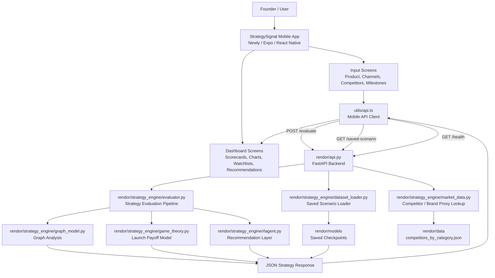
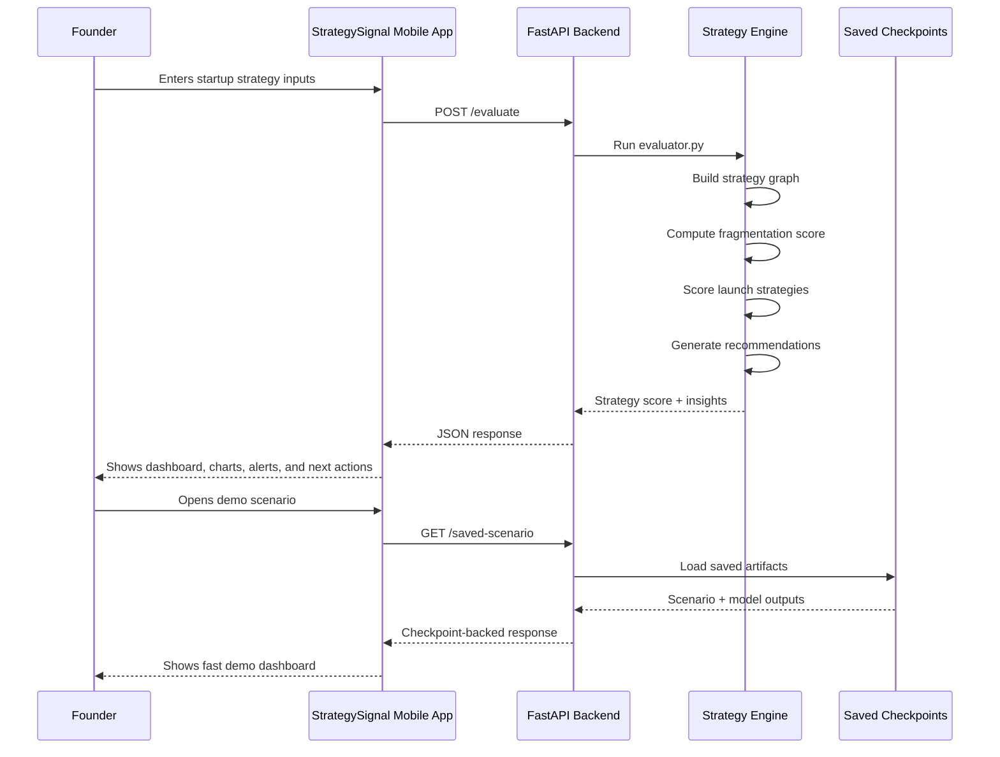

# StrategySignal Architecture

StrategySignal uses a mobile-first architecture. The Newly / Expo app handles user interaction, while the Python FastAPI backend in `rendor/` handles strategy evaluation and checkpoint-backed demo flows.

## Component Map

## Layers

| Layer | Location | Responsibility |
| --- | --- | --- |
| Mobile app | `app/`, `components/`, `utils/`, `assets/` | Collect inputs and render the dashboard |
| API client | `utils/api.ts` | Calls the backend and normalizes responses for the UI |
| Backend API | `rendor/api.py` | Exposes `/evaluate`, `/saved-scenario`, and `/health` |
| Strategy engine | `rendor/strategy_engine/` | Runs graph analysis, payoff scoring, recommendations, and data loading |
| Saved artifacts | `rendor/models/` | Stores checkpoint files for fast demo playback |
| Data helpers | `rendor/data/` | Stores competitor and category lookup data |

## Request Flow

